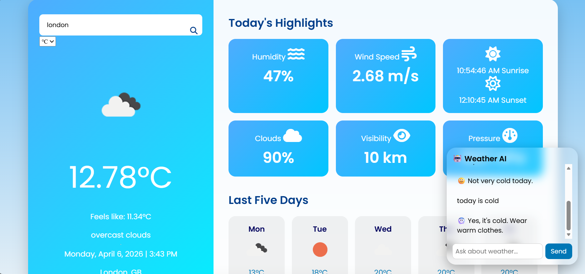

#  Weather Forecasting Web Application with Chatbot

##  Project Overview

This project is a **Weather Forecasting Web Application** developed using **HTML, CSS, and JavaScript**. It provides real-time weather updates by integrating a weather API and includes a **rule-based chatbot** that allows users to interact and get weather information in a conversational manner.

The application helps users check weather conditions easily for any city with a clean and responsive interface.

---

##  Features

* 🌤 Real-time weather data using API
* 💬 Rule-based chatbot for user interaction
* 📍 Search weather by city name
* 🌡 Displays temperature, humidity, and wind speed
* 📱 Responsive design (works on mobile & desktop)
* ⚡ Fast and lightweight frontend

---

##  Tech Stack

* **Frontend:** HTML, CSS, JavaScript
* **API:** Weather API (e.g., OpenWeather API)
* **Chatbot:** Rule-based logic using JavaScript

---

## Screenshots




---

##  How It Works

1. User enters a city name
2. Application sends request to weather API
3. API returns real-time weather data
4. Data is displayed on the UI
5. Chatbot responds to user queries based on predefined rules

---


---

##  Installation & Setup

1. Clone the repository:

```bash
git clone https://github.com/your-username/weather-forecasting-app-with-chatbot.git
```

2. Open the project folder:

```bash
cd weather-forecasting-app-with-chatbot
```

3. Open `index.html` in your browser

---

##  API Setup

* Sign up for a weather API (like OpenWeather)
* Get your API key
* Replace it in your JavaScript file:

```javascript
const apiKey = "YOUR_API_KEY";
```

---

## 📌 Future Improvements

*  Add voice-based chatbot
*  Upgrade to AI-based chatbot
*  Add weather charts & graphs
*  Auto-detect user location

---

## 📜 License

This project is licensed under the **MIT License**.

---

## 🙌 Acknowledgment

* Weather API provider
* Open-source community

---

## 👤 Author

**Sahil Kamble**

---

## ⭐ Support

If you like this project, give it a ⭐ on GitHub!

